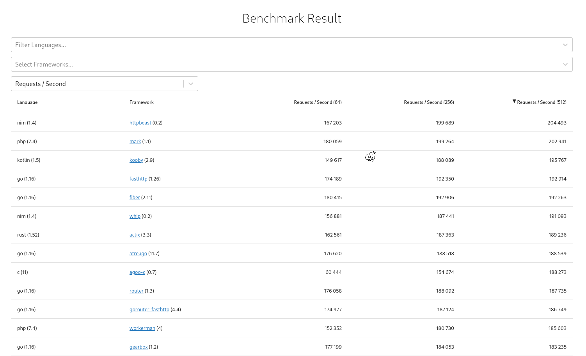

# First Mark RESTful PHP

Build a PHP RESTful with fastest Web micro-framework in the world!

## Features of this project and code-base

- Mark: Web micro-framework
- Medoo: Easy database functionality
- Mariadb: Database
- Some useful function to check body and input of your routes
- Unit-Tests with **Python** scripts
- Optimized and clean Database tables ([database.sql](database.sql))

By the way, I think it's good to package if you want to easily and fast go up.

## What is Mark?

Mark is a high performance micro framework based on [workerman](https://github.com/walkor/workerman) helps you quickly write APIs with php.

Probably the fastest PHP web framework in the world. See [the-benchmarker](https://web-frameworks-benchmark.netlify.app/result?asc=0&order_by=level512).

[](https://web-frameworks-benchmark.netlify.app/result?asc=0&order_by=level512)

## How to deploy?

**$ php index.php**

```
Usage: php yourfile <command> [mode]
Commands: 
start		Start worker in DEBUG mode.
		Use mode -d to start in DAEMON mode.
stop		Stop worker.
		Use mode -g to stop gracefully.
restart		Restart workers.
		Use mode -d to start in DAEMON mode.
		Use mode -g to stop gracefully.
reload		Reload codes.
		Use mode -g to reload gracefully.
status		Get worker status.
		Use mode -d to show live status.
connections	Get worker connections.
```

## Routes of this example project

```
// Main routes
$api->post('/v2/verification[/]', function ($request) {}
$api->post('/v2/sign-in[/]', function ($request) {}
$api->post('/v2/guest[/]', function ($request) {}

// Old just to test
$api->any('/', function ($request) {}
$api->post('/user/create', function ($request) {}
$api->get('/hello/{name}[/]', function ($request, $name) {}
```

## My Performance Benchmark

### Hardware

**CPU:** Intel Core i5-9400F @ 6x 4.1GHz [57.0°C]

```
wrk -c 400 -d 60s -t 8 http://127.0.0.1:3003 --latency
```

Result:

```
Running 1m test @ http://127.0.0.1:3003
  8 threads and 400 connections
  Thread Stats   Avg      Stdev     Max   +/- Stdev
    Latency     1.58ms    2.57ms  43.52ms   90.30%
    Req/Sec    58.11k    19.26k  136.26k    71.07%
  Latency Distribution
     50%  610.00us
     75%    1.73ms
     90%    4.05ms
     99%   13.18ms
  27758931 requests in 1.00m, 3.28GB read
Requests/sec: 462288.91
Transfer/sec:     55.99MB
```


## But Why it's fastest in the world?

All of your functions, variables, and global variables will be parsed and ready before getting user requests.
And it's why this micro-framework is the fastest.

> I used PHP 8, And PHP runs code using its JIT. So I guess this will be fastest then when I decide to write a Restful in C or cpp.

Remember your script will be running always and you do not have to stop it. And keep running a database connection maybe cause some errors and problems.
And if you want to launch this project in production, you have to configure your database server.

For more details check this page:

https://stackoverflow.com/questions/33250453/how-to-solve-general-error-2006-mysql-server-has-gone-away

© Copyright Max Base, 2021
